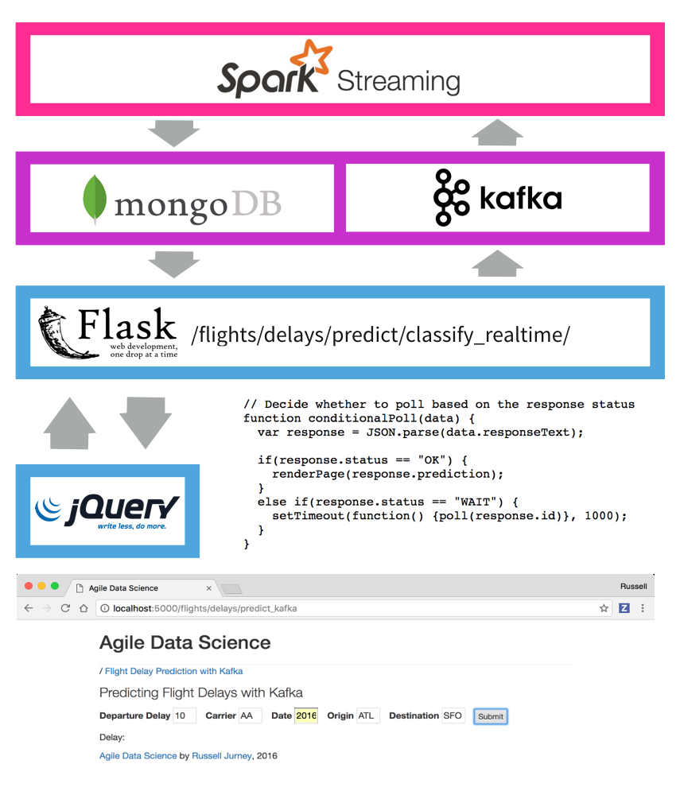

# Trabajo-BDFI  Predicciones de retrasos de vuelos
Esta práctica que arranca del repositorio publicado https://github.com/ging/practica_big_data_2019 y este deriva de otro anterior https://github.com/rjurney/Agile_Data_Code_2 . 
En esta practica se resuelve el problema de desplegar el escenario con Docker Compose utilizando imagenes publicadas en Google Cloud.

##  Curso de análisis predictivo en tiempo real

[  ](http://datasyndrome.com/video)

## Descargar el proyecto principal 
Para poder arrancar con el despliegue de los componentes se ha estructurado un proyecto en un repositorio de github para poderse descargar en local.
para ello primero se crea un directorio en el escritorio al que llamaremos PruebasDocker ------

```
mkdir PruebasDocker
cd PruebasDocker
```
Una vez dentro de este directrio importaremos el proyecto desde el repositorio.
```
git clone https://github.com/jgonzori3/Trabajo-BDFI.git
```

Debemos tener en cuenta que para este proyecto se necesita al menos trabajar en una maquina que tenga ubuntu 20 por temas de compatibilidad entre versiones.
Se trabajará con las siguientes versiones de software: 

 - [Intellij](https://www.jetbrains.com/help/idea/installation-guide.html) (jdk_1.8)
 - [Pyhton3](https://realpython.com/installing-python/) (Suggested version 3.8) 
 - [PIP](https://pip.pypa.io/en/stable/installing/)
 - [SBT](https://www.scala-sbt.org/release/docs/Setup.html) 
 - [MongoDB](https://docs.mongodb.com/manual/installation/)
 - [Spark](https://spark.apache.org/docs/latest/) (Mandatory version 3.1.2)
 - [Scala](https://www.scala-lang.org)(Suggested version 2.12)
 - [Zookeeper](https://zookeeper.apache.org/releases.html)
 - [Kafka](https://kafka.apache.org/quickstart) (Mandatory version kafka_2.12-3.0.0)


# Procesos que se realizan

1. Inicialmente se parte de un dataset que recoje infomacion sobre vuelos y retrasos de los mismos. 

2. Seguidamente estos datos serviran para entrenar un Modelo de Machine Learning. estos pasos se han realizado previo a publicacion de este repositorio y se presentan los resultados almacenados dentro de la carpeta **data** dentro del proyectos, que ademas ya son almacenados en la base de datos de mongo.

3. para el correcto funcionamiento del conjunto de servicios se establecen los flujos de comunicacion entre el Job de Spark y el propio servido WebFlask. esta comunicacion se ha implementado con Zookeeper y kafka y see crea un topica al que el job de Spark se encuentra suscrito.

4. Se Utiliza PySpark con un algoritmo RandomForest para entrenar los modelos predictivos que se mencionaron anteriormente.

5. Para realizar las prediciones en base a los datos entregados por el usuario a traves del interfaz web, se ejecuta el job de Spark.

6. El job de Spark se ejecuta usando el spark-submit con el fichero .jar que haciendo uso de las clases de Scala podrá genrar un Stream al suscribirse al topic previamente creado con por kafka pudiendo así subscribirse y "consumir" los datos, y además se conectará a la base de datos de mongo para incluir las predicciones.

7. Finalmente se podran mostrar las diferentes prediciones que se van generando gracias al Polling continuo que hace Flask a mongo utilizando el canal generado por kafka que se ha mencionado anteriormente. Será a traves de la interfaz web de Flask a traves de la cual se podran mandar los datos para hacer las predicciones y será por donde se podrán observar los resultados.

# Hitos alcanzados

1. Lograr el funcionamiento de la práctica sin realizar modificaciones (4 puntos).
2. Ejecución del job de predicción con Spark Submit en vez de IntelliJ (1 punto).
3. Dockerizar cada uno de los servicios que componen la arquitectura completa. (1 punto)
4. Desplegar el escenario completo usando docker-compose. (1 punto)
5. Desplegar el escenario completo en Google Cloud (ya veremos). (500 puntos para griffindor)
6. Entrenar el modelo con Apache Airflow (Griffidor hace el chanchullo y gana)

## Autores
- Alejandro Moreno 
- Jesús González


# Información Adicional Del Proyecto


##  La pirámide del valor de los datos

Originalmente por Pete Warden, la pirámide de valores de datos es cómo se organiza y estructura el libro. Lo subimos a medida que avanzamos cada capítulo.


## Arquitectura del sistema

Los siguientes diagramas se extraen del libro y expresan los conceptos básicos de la arquitectura del sistema. Las arquitecturas de front-end y back-end funcionan juntas para crear un sistema predictivo completo.

## Arquitectura Front End

Este diagrama muestra cómo funciona la arquitectura de front-end en nuestra aplicación de predicción de retrasos de vuelos. El usuario completa un formulario con información básica en un formulario en una página web, que se envía al servidor. El servidor completa algunos campos necesarios derivados de los del formulario como "día del año" y emite un mensaje de Kafka que contiene una solicitud de predicción. Spark Streaming está escuchando en una cola de Kafka para estas solicitudes y hace la predicción, almacenando el resultado en MongoDB. Mientras tanto, el cliente recibió un UUID en la respuesta del formulario y ha estado sondeando otro punto final cada segundo. Una vez que los datos están disponibles en Mongo, la próxima solicitud del cliente los recoge. ¡Finalmente, el cliente muestra el resultado de la predicción al usuario!

Esta configuración es extremadamente divertida de configurar, operar y observar. ¡Consulte los capítulos 7 y 8 para obtener más información!



## Arquitectura de back-end

El diagrama de la arquitectura de back-end muestra cómo entrenamos un modelo clasificador utilizando datos históricos (todos los vuelos desde 2015) en el disco (HDFS o Amazon S3, etc.) para predecir retrasos en los vuelos por lotes en Spark. Guardamos el modelo en el disco cuando esté listo. A continuación, lanzamos Zookeeper y una cola de Kafka. Usamos Spark Streaming para cargar el modelo clasificador y luego escuchamos las solicitudes de predicción en una cola de Kafka. Cuando llega una solicitud de predicción, Spark Streaming realiza la predicción y almacena el resultado en MongoDB, donde la aplicación web puede recogerlo.

Esta arquitectura es extremadamente poderosa y es un gran beneficio que podamos usar el mismo código por lotes y en tiempo real con PySpark Streaming.


# capturas de pantalla

A continuación se muestran algunos ejemplos de partes de la aplicación que construimos en este libro y en este repositorio. ¡Mira el libro para más!

## Página de la entidad de la aerolínea

Cada aerolínea tiene su propia página de entidad, completa con un resumen de su flota y una descripción extraída de Wikipedia.


## Página de la flota de aviones

Demostramos resumir una entidad con una página de flota de aviones que describe toda la flota.


## Interfaz de usuario de predicción de retrasos de vuelos

Creamos un sistema predictivo completo en tiempo real con un front-end web para enviar solicitudes de predicción.


