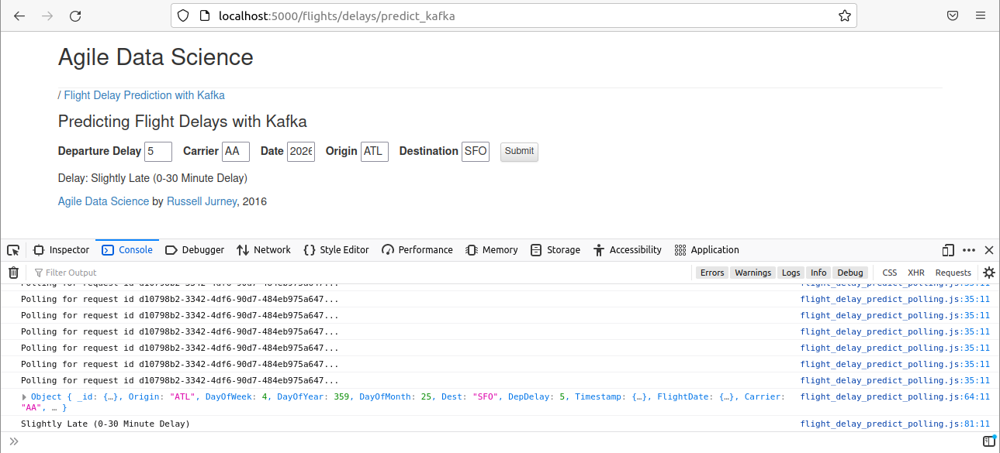
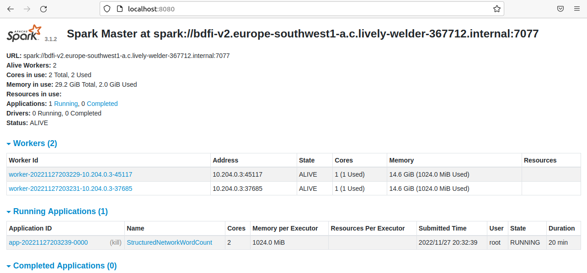
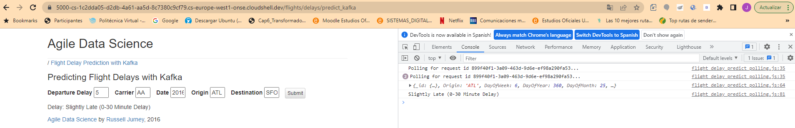
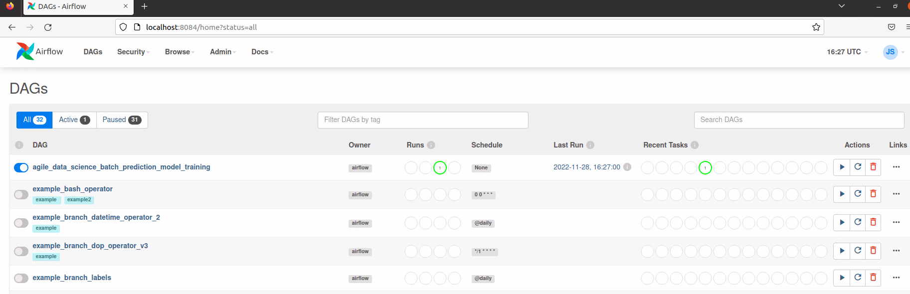

# ✈️ Trabajo-BDFI  Predicciones de retrasos de vuelos ✈️
Esta práctica que arranca del repositorio publicado https://github.com/ging/practica_big_data_2019 y este deriva de otro anterior https://github.com/rjurney/Agile_Data_Code_2 . 
En esta practica se resuelve el problema de desplegar el escenario con Docker Compose utilizando imagenes publicadas en Google Cloud.

## 1. Curso de análisis predictivo en tiempo real y versiones utilizadas

[  ](http://datasyndrome.com/video)


Debemos tener en cuenta que para este proyecto se necesita al menos trabajar en una maquina que tenga ubuntu 20.04 por temas de compatibilidad entre versiones.
Se trabajará con las siguientes versiones de software: 

 - [Intellij](https://www.jetbrains.com/help/idea/installation-guide.html) (jdk_1.8)
 - [Pyhton3](https://realpython.com/installing-python/) (version 3.8) 
 - [PIP](https://pip.pypa.io/en/stable/installing/)(version 20.0.2)
 - [SBT](https://www.scala-sbt.org/release/docs/Setup.html) (version 1.8.0)
 - [MongoDB](https://docs.mongodb.com/manual/installation/)(version 4.4.18)
 - [Spark](https://spark.apache.org/docs/latest/) (version 3.1.2)
 - [Scala](https://www.scala-lang.org)(version 2.12.10)
 - [Zookeeper](https://zookeeper.apache.org/releases.html) (version 3.4.13)
 - [Kafka](https://kafka.apache.org/quickstart) (version kafka_2.12-3.0.0)
 - [Airflow](https://airflow.apache.org/docs/apache-airflow/2.0.1/installation.html) (version 2.1.4)

## 2. Procesos que se realizan 📋

1. Descargar los datos de vuelos pasados.

2. Entrenar modelo de Machine Learning utilizando los datos de vuelos.

3. Desplegar el job de Spark que predice el retraso de los vuelos usando el modelo creado.

4. Por medio de una interfaz web, el usuario introducirá los datos del vuelo a predecir, que se enviarán al servidor web de Flask.

5. El servidor web enviará estos datos al job de predicción a través de Kafka.

6. El job realizará la predicción y la guardará en Mongo.

7. La interfaz web está constantemente haciendo polling para comprobar si se ha realizado ya la predicción.

8. En caso afirmativo, se muestra la predicción en la interfaz

## 3. Hitos alcanzados ✅

1. Lograr el funcionamiento de la práctica sin realizar modificaciones ejecutando el Job de prediccion con Intellij. (4 puntos).
2. Ejecución del Job de predicción con Spark Submit en vez de IntelliJ tanto de forma local como de forma Standalone con 2 workers. (1 punto).
3. Dockerizar cada uno de los servicios que componen la arquitectura completa. (1 punto)
4. Desplegar el escenario completo usando Docker-Compose. (1 punto)
5. Desplegar el escenario completo en Google Cloud en una maquina virtual accediendo a esta a través del gestor de interfaces gráficas de Nomachine (1 punto).
6. Habilitar el despliegue del escenario completo en el Container Registry de Google Cloud (https://console.cloud.google.com/gcr/images/imagenesdocker-368517/). 
7. Se propone una solución que utiliza Airflow ejecutandose en la maquina virtual de manera local.

Para complementar la solución desplegada en cloud (punto 6 de hitos alcanzados) se han publicado en Google Cloud todas las imágenes que usamos para hacer docker compose garantizando así que siempre podremos tener acceso a ellas de forma universal accediendo a ellas ejecutando los siguientes pull:
```
docker pull gcr.io/imagenesdocker-368517/kafka:latest
docker pull gcr.io/imagenesdocker-368517/kafka2:latest
docker pull gcr.io/imagenesdocker-368517/mongo:latest
docker pull gcr.io/imagenesdocker-368517/spark:latest
docker pull gcr.io/imagenesdocker-368517/webflask:latest
docker pull gcr.io/imagenesdocker-368517/zookeeper:latest
```

El comando que se ejecutará en la Shell de Google Cloud para publicar imagenes a partir de Dockerfiles es el siguiente.

```
gcloud builds submit --tag gcr.io/<proyect_id>/<tag_name>
```
Con esta solución el único fichero necesario será el docker-compose.yml 


### 3.1 Pasos para montar el escenario 🚀

Para poder arrancar desde un entorno sin imagenes de máquinas virtuales residuales y liberar espacio para arrancar nuestro escenario, lo primero se deberá ejecutar el docker prune en el sistema.

```
sudo docker system prune -a
```
Seguidamente se descargará el proyecto principal desde el repositorio https://github.com/jgonzori3/trabajoBDFI.git ejecutando:
```
git clone https://github.com/jgonzori3/trabajoBDFI.git
```
Una vez dentro del proyecto, para poder desplegar todo el escenario desde el fichero docker-compose-yml, nos ubicaremos en el directorio dockerfiles del proyecto con el siguiente comando:
```
cd practica_big_data_2019/dockerfiles
```
Para desplegar el escenario utilizando Docker se hará uso de docker-compose.yml con el siguiente comando:
```
sudo docker-compose up
```
Este comando puede tardar unos minutos en importar y arrancar las imágenes desde nuestro proyecto en Google Cloud donde están publicadas.
Una vez se han arrancado todas las imagenes podremos contar con las siguientes interfaces web:
1. Interfaz Web del Flight Prediction (http://localhost:5000/flights/delays/predict_kafka):



2. Interfaz Web de Spark Master como Cluster Standalone (http://localhost:8080):




## 4. Despliegue en el Container Registry de Google Cloud (opcional) ☁️

Como se mencionó en el punto 6 de hitos alcanzados, la solución propuesta permite su despliegue desde la propia shell de Google Cloud. Lo único que habrá que hacer es crear un fichero docker-compose.yml dentro de nuestro proyecto en Google, copiar el contenido del docker-compose.yml mencionado anteriormente y ejecutar:
```
sudo docker-compose up
```
De esta manera al ejecutarse Google Cloud genera una serie se asociaciones entre las direcciones y puertos que se generan el el docker compose con direcciones URL accesibles desde cualquier navegador del mundo dando los permisos correspondientes. Estas direcciones presentan una estructura similar a la siguiente: https://5000-cs-1c2dda05-d2db-4a61-aa5d-8c7380c9cf79.cs-europe-west1-onse.cloudshell.dev/flights/delays/predict_kafka 

Se muestra a continuación una captura del navegador con la anterior dirección mostrando cómo está corriendo la aplicación:




## 5. Apache Airflow (opcional)

Apache Airflow es una herramienta open source de tipo workflow manager (gestionar, monitorizar y planificar flujos de trabajo, usada como orquestador de servicios). Airflow se usa para automatizar trabajos programáticamente dividiéndolos en subtareas. Los casos de uso más comunes son la automatización de ingestas de datos, acciones de mantenimiento periódicas y tareas de administración. También podemos usar Airflow para orquestar testing automático de componentes, backups y generación de métricas y reportes.

En Airflow, se trabaja con DAGs (Directed Acyclic Graphs). Son colecciones de tareas o de trabajos a ejecutar conectados mediante relaciones y dependencias. Son la representación de los flujos de trabajo (workflows). Generalmente, cada DAG está formado por un conjunto de tareas (tasks). Estas tareas son la unidad básica de ejecución de Airflow donde suelen ser atómicas y se definen utilizando el lenguaje Python.


### 5.1 Arquitectura de Apache Airflow

Para explicar la arquitectura de Apache Airflow la siguiete imagen es muy ilustrativa.


Donde se pueden destacar los siguientes componentes:

* **Scheduler:** Se encarga de activar los DAGs y de cargarlos en el ejecutor de tareas.
* **Executor:** Maneja las tareas que están en ejecución mandandoselo generalmente a los workers.
* **Webserver:** Interfaz web que permite al usuario inspeccionar, activar y depurar los DAGs (estado actual del DAG, ultima ejecución, consulta de logs, etc).
* **Directorio DAG:** Ruta donde el usuario puede introducir los DAGs para que se muestren en la interfaz web y se ejecuten en la herramienta. Estos ficheros deberán estar descritos utilizando el lenguaje Python.
* **Metadata Database:** utilizada por el Scheduler, el Executor y el servidor web para almacenar el estado.

### 5.2 Ejecución de entorno virtualizado (opcional)

En primer lugar, es muy recomendable desplegar un entorno virtualizado de Python para trabajar de manera aislada con las dependencias de Airflow sin alterar de manera global las dependecias de Python de la maquina virtual. Una vez, el escenario vitualizado esté creado, accederemos al mismo utilizando los comandos que se muestran a continuacion. En el caso de este proyecto, el entorno virtualizado se llama "airflow_env":

```
cd environments
source airflow_env/bin/activate
```

### 5.3 Ejecución de dependencias de Airflow 

Para el despliegue de Apache Airflow en el proyecto será necesario seguir una serie de pasos para desplegar de manera local la herramienta.

La primera vez que se ejecute el entorno virtualizado, será necesario instalar las dependencias necesarias para Airflow. Esto solo se hará una única vez:

Dentro del proyecto (practica_big_data_2019) accederemos al directorio airflow e instalaremos las dependencias:

```
cd resources/airflow
pip install -r requirements.txt -c constraints.txt
```

Inicializamos la base de datos:

```
airflow db init
```
Creamos las carpetas "dags", "logs" y "plugins" dentro del directorio donde se ha creado airflow:

```
export AIRFLOW_HOME=~/airflow
mkdir $AIRFLOW_HOME/dags
mkdir $AIRFLOW_HOME/logs
mkdir $AIRFLOW_HOME/plugins
```

Por ultimo, se creará un nuevo usuario con el siguiente comando:
```
airflow users create \
    --username admin \
    --firstname Jack \
    --lastname  Sparrow\
    --role Admin \
    --email example@mail.org\
    --password password 
```

### 5.4 Inicialización de los servicios

En primer lugar, establecemos la variable de entorno PROJECT_HOME en la ruta donde esté situado el repositorio para que el ficher setup.py pueda leer la variable de entorno:

```
export PROJECT_HOME=/home/user1/trabajoBDFI/practica_big_data_2019
```

Una vez configurado airflow en la máquina virtual (tanto en el servicio virtualizado o si se prefiere de manera local en el Python instalado en la máquina virtual), se podrá iniciar la herramienta con los siguientes comandos mostrados:

```
airflow webserver --port 8084
airflow scheduler
```

Como resultado, se podrá observar un entorno web que contendrá una serie de ejemplos de DAG creados al inicializar la base de datos. Adicionalmente, todos los DAGs que el usuario genere podrá subirlos a la plataforma web incluyendo los ficheros (como por ejemplo setup.py) dentro del directorio $AIRFLOW_HOME/dags.





### 5.5 Análisis setup.py


```ruby
import sys, os, re

from airflow import DAG
from airflow.operators.bash import BashOperator

from datetime import datetime, timedelta
import iso8601

PROJECT_HOME = os.getenv("PROJECT_HOME")

# Con los siguientes campos se puede determinar las propiedades principales
# para este ejemplo de setup.py se introducen dos caranteristicas importante 
# 'retries' determina el numero de intentos antes de morirse el DAG
# 'retry_delay' determina el tiempo de espera entre reintentos para los casos en los que falla

default_args = {
  'owner': 'airflow',
  'depends_on_past': False,
  'start_date': iso8601.parse_date("2016-12-01"),
  'retries': 3,
  'retry_delay': timedelta(minutes=5),
}

# En esta secciones se continua configurando el DAG, se le asocia un nombre, 
# los argumentos por defecto determinados anteriormente, tambien se determina
#schedule_interval=none  que nos indica que se se va a ejecutar mas que cuando 
# se hace forma manual. 
training_dag = DAG(
  'agile_data_science_batch_prediction_model_training',
  default_args=default_args,
  schedule_interval=None
)


# We use the same two commands for all our PySpark tasks
#Se puede observar como se usa la misma estrctura de comandos en todas las tareas diferenciandose
#exclusivamente en su identificados
pyspark_bash_command = """
spark-submit --master {{ params.master }} \
  {{ params.base_path }}/{{ params.filename }} \
  {{ params.base_path }}
"""
pyspark_date_bash_command = """
spark-submit --master {{ params.master }} \
  {{ params.base_path }}/{{ params.filename }} \
  {{ ts }} {{ params.base_path }}
"""


# Gather the training data for our classifier
# Es en las siguientes lineas donde se definen las operaciones Bash con todos los 
# campos rellenados hasta ahora 
# se determina la direccion en la que es escucha al master de spark
# la direccion del fichero Python donde se encuentra toda la logica del DAG
# la direccion que utiliza internamente para determinar direcciones absolutas en el sistema de ficheros
"""
extract_features_operator = BashOperator(
  task_id = "pyspark_extract_features",
  bash_command = pyspark_bash_command,
  params = {
    "master": "local[8]",
    "filename": "resources/extract_features.py",
    "base_path": "{}/".format(PROJECT_HOME)
  },
  dag=training_dag
)

"""

# Train and persist the classifier model
train_classifier_model_operator = BashOperator(
  task_id = "pyspark_train_classifier_model",
  bash_command = pyspark_bash_command,
  params = {
    "master": "local[8]",
    "filename": "resources/train_spark_mllib_model.py",
    "base_path": "{}/".format(PROJECT_HOME)
  },
  dag=training_dag
)

```

Se adjuntan a continuacionuna tabla de los posibles valores que se puede asociar al scheduler_interval en funcion de la periodicidad con que se repite:

| Scheduler         |Description |
| --- | --- |
| None         | Don’t schedule, use for exclusively “externally triggered” DAGs |
| @once        |   	Schedule once and only once                                  | 
| @hourly      |Run once an hour at the beginning of the hour  | 
| @daily	      |Run once a day at midnight	      | 
| @weekly	     |Run once a week at midnight on Sunday morning      | 
| @monthly	    |Run once a month at midnight of the first day of the month      | 
| @yearly      |Run once a year at midnight of January      | 


## Autores ✒️
- Alejandro Moreno - [amorenog9](https://github.com/amorenog9)
- Jesús González -  [jgonzori3](https://github.com/jgonzori3)


