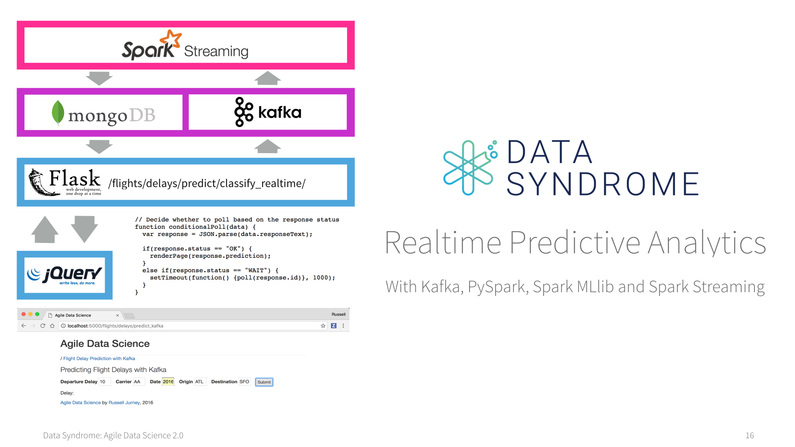

# Trabajo-BDFI  Predicciones de retrasos de vuelos
Esta práctica que arranca del repositorio publicado https://github.com/ging/practica_big_data_2019 y este deriva de otro anterior https://github.com/rjurney/Agile_Data_Code_2 . 
En esta practica se resuelve el problema de desplegar el escenario con Docker Compose utilizando imagenes publicadas en Google Cloud.

##  Curso de análisis predictivo en tiempo real

[  ](http://datasyndrome.com/video)


Debemos tener en cuenta que para este proyecto se necesita al menos trabajar en una maquina que tenga ubuntu 20.04 por temas de compatibilidad entre versiones.
Se trabajará con las siguientes versiones de software: 

 - [Intellij](https://www.jetbrains.com/help/idea/installation-guide.html) (jdk_1.8)
 - [Pyhton3](https://realpython.com/installing-python/) (version 3.8) 
 - [PIP](https://pip.pypa.io/en/stable/installing/)(version 20.0.2)
 - [SBT](https://www.scala-sbt.org/release/docs/Setup.html) (version 1.8.0)
 - [MongoDB](https://docs.mongodb.com/manual/installation/)(version 4.4.18)
 - [Spark](https://spark.apache.org/docs/latest/) (version 3.1.2)
 - [Scala](https://www.scala-lang.org)(version 2.12.10)
 - [Zookeeper](https://zookeeper.apache.org/releases.html) (version 3.4.13)
 - [Kafka](https://kafka.apache.org/quickstart) (version kafka_2.12-3.0.0)
 - [Airflow](https://airflow.apache.org/docs/apache-airflow/2.0.1/installation.html) (version 2.1.4)

# Procesos que se realizan

1. Descargar los datos de vuelos pasados.

2. Entrenar modelo de Machine Learning utilizando los datos de vuelos.

3. Desplegar el job de Spark que predice el retraso de los vuelos usando el modelo creado.

4. Por medio de una interfaz web, el usuario introducirá los datos del vuelo a predecir, que se enviarán al servidor web de Flask.

5. El servidor web enviará estos datos al job de predicción a través de Kafka.

6. El job realizará la predicción y la guardará en Mongo.

7. La interfaz web está constantemente haciendo polling para comprobar si se ha realizado ya la predicción.

8. En caso afirmativo, se muestra la predicción en la interfaz

# Hitos alcanzados

1. Lograr el funcionamiento de la práctica sin realizar modificaciones ejecutando el Job de prediccion con Intellij. (4 puntos).
2. Ejecución del Job de predicción con Spark Submit en vez de IntelliJ tanto de forma local como de forma Standalone con 2 workers. (1 punto).
3. Dockerizar cada uno de los servicios que componen la arquitectura completa. (1 punto)
4. Desplegar el escenario completo usando Docker-Compose. (1 punto)
5. Desplegar el escenario completo en Google Cloud en una maquina virtual accediendo a esta a través del gestor de interfaces gráficas de Nomachine (1 punto).
6. Habilitar el despliegue del escenario completo en el Container Registry de Google Cloud. 
7. Se propone una solucion que utiliza Airflow como gestor de tareas en la siguiente https://github.com/jgonzori3/trabajoBDFI_v2.git

Para complementar la solución desplegada en cloud (punto 6 de hitos alcanzados) se han publicado en Google Cloud todas las imágenes que usamos para hacer el docker compose garantizando así que siempre podremos tener acceso a ellas de forma universal accediendo a ellas ejecutando los siguientes pull:
```
docker pull gcr.io/imagenesdocker-368517/kafka:latest
docker pull gcr.io/imagenesdocker-368517/kafka2:latest
docker pull gcr.io/imagenesdocker-368517/mongo:latest
docker pull gcr.io/imagenesdocker-368517/spark:latest
docker pull gcr.io/imagenesdocker-368517/webflask:latest
docker pull gcr.io/imagenesdocker-368517/zookeeper:latest

```

El comando que se ejecutará en la Shell de Google Cloud para publicar imagenes a partir de Dockerfiles es el siguiente.

```
gcloud builds submit --tag gcr.io/<proyect_id>/<tag_name>
```
Con esta solución el unico fichero que seria necesario seria el docker-compose.yml 

Para la automaticación de tareas hemos utilizado Apache Airflow que nos permite operaciones como borrar de la base de datos todas las peticiones que se hayan realizado en el ultimo mes, o reentrenar el modelo una vez a la semana anadiendo nuevos datos.

## Pasos para montar el escenario

Para poder arrancar desde un entorno sin imagenes de maquinas virtuales residuales y liberar espacio para arrancar nuestro escenario, lo primero de deberá ejecutar el docker prune en el sistema.

```
sudo docker system prune -a
```
Seguidamente se descargar el proyecto principal desde el repositorio https://github.com/jgonzori3/trabajoBDFI.git ejecutando:
```
git clone https://github.com/jgonzori3/trabajoBDFI.git
```
Para poder desplegar todo el escenario desde el fichero docker-compose-yml nos ubicaremos en la direccion /home/user1/trabajoBDFI/tree/master/practica_big_data_2019/dockerfiles:
```
cd /home/user1/trabajoBDFI/tree/master/practica_big_data_2019/dockerfiles
```
en este diectorio se levanta el escenario del docker-compose.yml:
```
sudo docker-compose up
```
Este comando puede tardar unos minutos en importar y arrancar las imágenes desde nuestro proyecto en Google Cloud donde están publicadas.
Una vez se han arrancado todas las imagenes podremos contar con las siguientes interfaces web:
1. Interfaz Web del Flight Prediction:


2. Interfaz Web de Spark Master como Cluster Standalone:


# Despliegue en el Container Registry de Google Cloud

Como se mencionó en el punto 6 de hitos alcanzados, la solucion propuesta permite su despliegue desde la propia shell de Google Cloud. Lo unico que habrá que hacer es crear un fichero docker-compose.yml dentro de nuestro proyecto en Google, copiar el contenido del docker-compose.yml mencionado anteriormente y ejecutar:
```
sudo docker-compose up
```
De esta manera al ejecutarse Google Cloud genera una serie se asociaciones entre las direcciones y puertos que se generan el el docker compose con direcciones URL accesibles desde cualquier navegador del mundo. Estas direcciones presentan una estructura similar a la siguiente: https://5000-cs-1c2dda05-d2db-4a61-aa5d-8c7380c9cf79.cs-europe-west1-onse.cloudshell.dev/flights/delays/predict_kafka 

Se muestra acontinuacion una captura del navegador con la anterior direccion mostrando cómo está corriendo la aplicación:


# Airflow

Apache Airflow es una herramienta de tipo workflow manager (gestionar, monitorizar y planificar flujos de trabajo, usada como orquestador de servicios).Airflow se usa para automatizar trabajos programáticamente dividiéndolos en subtareas. Los casos de uso más comunes son la automatización de ingestas de datos, acciones de mantenimiento periódicas y tareas de administración. También podemos usar Airflow para orquestar testing automático de componentes, backups y generación de métricas y reportes.
En Airflow, se trabaja con DAGs (Directed Acyclic Graphs). Son colecciones de tareas o de trabajos a ejecutar conectados mediante relaciones y dependencias. Son la representación de los workflows.
Cada una de las tareas del DAG representada como un nodo, se describe con un operador y generalmente es atómica.

```ruby
import sys, os, re

from airflow import DAG
from airflow.operators.bash import BashOperator

from datetime import datetime, timedelta
import iso8601

PROJECT_HOME = os.getenv("PROJECT_HOME")

# Con los siguientes campos se puede determinar las propiedades principales
# para este ejemplo de setup.py se introducen dos caranteristicas importante 
# 'retries' determina el numero de intentos antes de morirse el DAG
# 'retry_delay' determina el tiempo de espera entre reintentos para los casos en los que falla

default_args = {
  'owner': 'airflow',
  'depends_on_past': False,
  'start_date': iso8601.parse_date("2016-12-01"),
  'retries': 3,
  'retry_delay': timedelta(minutes=5),
}

# En esta secciones se continua configurando el DAG, se le asocia un nombre, 
# los argumentos por defecto determinados anteriormente, tambien se determina
#schedule_interval=none  que nos indica que se se va a ejecutar mas que cuando 
# se hace forma manual. 

@weekly	Run once a week at midnight on Sunday morning	0 0 * * 0
@monthly	Run once a month at midnight of the first day of the month	0 0 1 * *
@yearly	Run once a year at midnight of January 1	0 0 1 1 *
training_dag = DAG(
  'agile_data_science_batch_prediction_model_training',
  default_args=default_args,
  schedule_interval=None
)


# We use the same two commands for all our PySpark tasks
#Se puede observar como se usa la misma estrctura de comandos en todas las tareas diferenciandose
#exclusivamente en su identificados
pyspark_bash_command = """
spark-submit --master {{ params.master }} \
  {{ params.base_path }}/{{ params.filename }} \
  {{ params.base_path }}
"""
pyspark_date_bash_command = """
spark-submit --master {{ params.master }} \
  {{ params.base_path }}/{{ params.filename }} \
  {{ ts }} {{ params.base_path }}
"""


# Gather the training data for our classifier
# Es en las siguientes lineas donde se definen las operaciones Bash con todos los 
# campos rellenados hasta ahora 
# se determina la direccion en la que es escucha al master de spark
# la direccion del ficher python donde se encuentra toda la logica del DAG
# la direccion que utiliza internamente para determinar direcciones absolutas en el sistema de ficheros
"""
extract_features_operator = BashOperator(
  task_id = "pyspark_extract_features",
  bash_command = pyspark_bash_command,
  params = {
    "master": "local[8]",
    "filename": "resources/extract_features.py",
    "base_path": "{}/".format(PROJECT_HOME)
  },
  dag=training_dag
)

"""

# Train and persist the classifier model
train_classifier_model_operator = BashOperator(
  task_id = "pyspark_train_classifier_model",
  bash_command = pyspark_bash_command,
  params = {
    "master": "local[8]",
    "filename": "resources/train_spark_mllib_model.py",
    "base_path": "{}/".format(PROJECT_HOME)
  },
  dag=training_dag
)

```

Se adjuntan a continuacionuna tabla de los posibles valores que se puede asociar al scheduler_interval en funcion de la periodicidad con que se repite:

| None         | Don’t schedule, use for exclusively “externally triggered” DAGs |
| --- | --- |
| @once        |   	Schedule once and only once                                  | 
| @hourly      |Run once an hour at the beginning of the hour  | 
| @daily	      |Run once a day at midnight	      | 
| @weekly	     |Run once a week at midnight on Sunday morning      | 
| @monthly	    |Run once a month at midnight of the first day of the month      | 
| @yearly      |Run once a year at midnight of January      | 


Para explicar la arquitectura de Apache Airflow la siguiete imagen es muy ilustrativa.


Se puede observar una base de datos de metadatos que incluye toda la información de los workflows, de sus estados y de sus dependencias. Este primer módulo se conecta al scheduler, este modulo extrae de los metadatos la informacion relativas al orden de ejecucion de las tareas y su prioridad. Ligado estrechamente con este se encuentra el executor que se encarga de determinar el nodo que va a ejecutar cada tarea. Por último en la parte superior encontramos los workers que serán los que se encarguen de ejecutar la logica de las tareas.

En paralelo se encuentra el servidor web que hace uso tanto de la informacion de la base de datos como de los logs generados por los workers para presentar esta informacion en su interfaz web.


## Autores
- Alejandro Moreno 
- Jesús González


