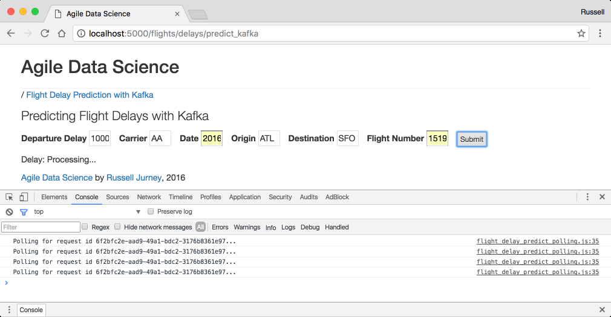

# Trabajo-BDFI

##  Curso de análisis predictivo en tiempo real

#  La pirámide del valor de los datos

# Arquitectura del sistema

Los siguientes diagramas se extraen del libro y expresan los conceptos básicos de la arquitectura del sistema. Las arquitecturas de front-end y back-end funcionan juntas para crear un sistema predictivo completo.

## Arquitectura Front End

Este diagrama muestra cómo funciona la arquitectura de front-end en nuestra aplicación de predicción de retrasos de vuelos. El usuario completa un formulario con información básica en un formulario en una página web, que se envía al servidor. El servidor completa algunos campos necesarios derivados de los del formulario como "día del año" y emite un mensaje de Kafka que contiene una solicitud de predicción. Spark Streaming está escuchando en una cola de Kafka para estas solicitudes y hace la predicción, almacenando el resultado en MongoDB. Mientras tanto, el cliente recibió un UUID en la respuesta del formulario y ha estado sondeando otro punto final cada segundo. Una vez que los datos están disponibles en Mongo, la próxima solicitud del cliente los recoge. ¡Finalmente, el cliente muestra el resultado de la predicción al usuario!

Esta configuración es extremadamente divertida de configurar, operar y observar. ¡Consulte los capítulos 7 y 8 para obtener más información!

## Arquitectura de back-end

El diagrama de la arquitectura de back-end muestra cómo entrenamos un modelo clasificador utilizando datos históricos (todos los vuelos desde 2015) en el disco (HDFS o Amazon S3, etc.) para predecir retrasos en los vuelos por lotes en Spark. Guardamos el modelo en el disco cuando esté listo. A continuación, lanzamos Zookeeper y una cola de Kafka. Usamos Spark Streaming para cargar el modelo clasificador y luego escuchamos las solicitudes de predicción en una cola de Kafka. Cuando llega una solicitud de predicción, Spark Streaming realiza la predicción y almacena el resultado en MongoDB, donde la aplicación web puede recogerlo.

Esta arquitectura es extremadamente poderosa y es un gran beneficio que podamos usar el mismo código por lotes y en tiempo real con PySpark Streaming.

# capturas de pantalla

A continuación se muestran algunos ejemplos de partes de la aplicación que construimos en este libro y en este repositorio. ¡Mira el libro para más!

## Página de la entidad de la aerolínea

Cada aerolínea tiene su propia página de entidad, completa con un resumen de su flota y una descripción extraída de Wikipedia.

## Página de la flota de aviones

Demostramos resumir una entidad con una página de flota de aviones que describe toda la flota.

## Interfaz de usuario de predicción de retrasos de vuelos

Creamos un sistema predictivo completo en tiempo real con un front-end web para enviar solicitudes de predicción.

